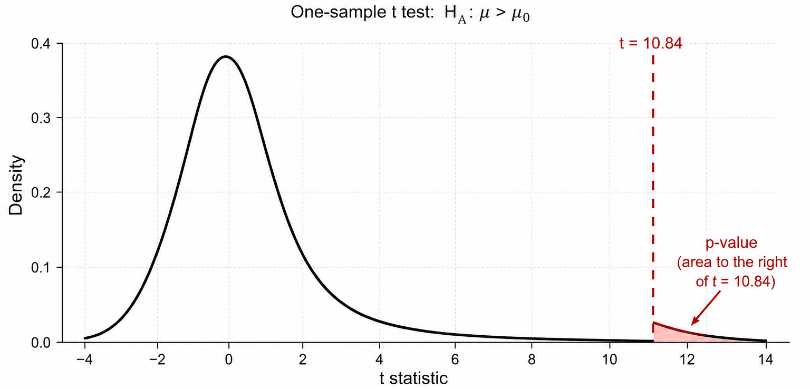

### Lecture Overview

- introduce the t-test framework for hypothesis testing with continuous data

Motivation: 

- many biomedical and clinical variables vary continuously across patients, including biomarker levels, tumor measurements, blood pressure, and symptom severity scores


The lecture introduces:

- t distribution
- t-statistics and p-values
- one-sample, independent two-sample, and paired t tests
---

### Background

::: {style="font-size:0.76em"}

As a review hypothesis tests involve:

- defining null and alternative hypotheses
  - null hypothesis represents a proposed explanation about the population
  - alternative hypothesis represents a competing scientific explanation suggesting the population mean is larger than the benchmark
- constructing a test statistic that summarized the stretch of evidence against the null hypothesis
- computing a p-value that quantifies the probability of having obtained a comparable or more extreme value of the test statistic under the null hypothesis
- based on the p-value we diced whether to reject the null hypothesis

- research often involves studying continuous variables such as: tumor volume, percent tumor reduction, circulating tumor DNA concentration, or immune-cell abundance
- measurements vary across patients because biological systems are inherently heterogeneous and because all sample-based measurements contain some degree of random variability


:::

---

### Background

::: {style="font-size:0.76em"}

- hypothesis tests for continuous data can be used as tools to help researchers determine whether an observed difference in a sample is large enough to suggest a meaningful population-level effect rather than ordinary sampling variability alone
- hypothesis tests allows one to determine whether the observed difference between two continuous outcomes is large relative to the amount of variability expected across repeated samples rather than just reporting the numerical difference between two continuous outcomes
- different statistical tests are used depending on what researchers want to compare and how the data were collected
- Review: **test statistic** is a numerical quantity calculated from sample data that measures how far the observed estimate is from the null value after accounting for variability
- in order to use continuous data to find evidence against or for the null hypothesis one computes a test statistic which summarizes the extent to which our data are consistent with $H_0$

:::

---

## Definition : t-test

::: {style="font-size:0.76em"}

`t-test` : statistical approach used to compare the means of two groups of continuous measurements

t-tests also account for:

- sampling variability
- sample size
- uncertainty in the population standard deviation

- continuous variables often vary across patients

For example:

- tumor burden differs across individuals
- gene expression varies continuously
- immune activation varies in magnitude

- t-tests are designed to evaluate whether the observed sample mean differs enough from a hypothesized population mean to suggest a true biological effect

The statistical test can be used for:

- comparing treatment groups
- evaluating biomarker effects
- testing mean biological changes

:::

---


## Review: Definition of a p-Value

::: {style="font-size:0.76em"}

`p-value`: probability of observing results at least as extreme as the observed data, given that the null hypothesis is true

The p-value measures:

> how unusual the observed sample result would be if the null hypothesis were true.

Small p-values indicate:

- observed data would be difficult to explain under the null model
- sample provides evidence against the null hypothesis

Large p-values indicate:

- observed data are reasonably consistent with the null model

:::

---

## Why a t Distribution Is Used

::: {style="font-size:0.76em"}

`t distribution` : probability distribution used to model uncertainty in standardized sample mean differences when the population standard deviation is unknown

The t distribution is used because:

- the population standard deviation is unknown
- variability must be estimated using the sample standard deviation

distribution accounts for:

- sampling variability
- uncertainty in the estimated standard deviation
- effects of small sample size

Distribution key characteristics:

- symmetric and centered at 0
- similar in shape to the standard normal distribution
- assigns greater probability to more extreme values

Note: as sample size increases:

- estimates of variability become more stable
- uncertainty decreases
- t distribution approaches the standard normal distribution

:::

---

## Why a t Distribution Is Used

::: {style="font-size:0.55em"}


```{r, echo=FALSE}
#| fig-width: 7
#| fig-height: 4.5


library(tidyverse)

x <- seq(-5, 5, length.out = 1000)

dist_df <- bind_rows(
  
  tibble(
    x = x,
    density = dnorm(x),
    distribution = "Standard normal"
  ),
  
  tibble(
    x = x,
    density = dt(x, df = 3),
    distribution = "t distribution (df = 3)"
  ),
  
  tibble(
    x = x,
    density = dt(x, df = 30),
    distribution = "t distribution (df = 30)"
  )
)

ggplot(
  dist_df,
  aes(
    x = x,
    y = density,
    color = distribution
  )
) +
  geom_line(linewidth = 1.2) +
  labs(
    title = "Normal Distribution vs t Distributions",
    x = "Value",
    y = "Density"
  ) +
  theme_bw()
```

**Interpretation**

- `standard normal distribution`: narrow distribution because the population standard deviation is treated as known

- `t distribution(s)`: wider overall because variability is estimated from the sample data and introduces additional uncertainty

This effect is strongest with small sample sizes:

- $t$ distribution with small degrees of freedom $(df = 3)$ has heavier tails
- extreme values are considered more plausible under the null hypothesis
- larger observed test statistics are therefore needed to produce small p-values

As sample size increases:

- estimates of variability become more stable
- uncertainty decreases
- t distribution $(df = 30)$ becomes closer to the standard normal distribution


:::

---


### Relationship Between the t-Statistic and p-Value

::: {style="font-size:0.76em"}

t-test produce both a test statistic [t-statistic] and p-value:

- test statistic measures distance from the null hypothesis

- p-value converts this distance into a probability under the null model

  - measures how extreme the observed test statistic is relative to the null distribution

Interpretation:

- large absolute t-statistics indicate that the observed difference is large compared with ordinary sampling variability

  → stronger evidence against the null hypothesis
  → smaller p-values

- small absolute t-statistics indicate that the observed difference is similar in magnitude to ordinary sampling variability

  → weaker evidence against the null hypothesis
  → larger p-values

:::

---

### Relationship Between the t-Statistic and p-Value

::: {style="font-size:0.76em"}

- p-value is found as an area under the t distribution

- t distribution represents the pattern of t-statistics we would expect to see from repeated samples if the null hypothesis were true

Once the observed t-statistic is determined ask:

> How much area is in the part of the t distribution that is as extreme as, or more extreme than, our observed t-statistic?

- area represents the p-value and location of the area depends on the alternative hypothesis

| Alternative hypothesis | Scientific meaning | Where the p-value area is found |
|---|---|---|
| $H_A: \mu > \mu_0$ | The population mean is greater than the benchmark | Area to the **right** of the calculated t-statistic |
| $H_A: \mu < \mu_0$ | The population mean is less than the benchmark | Area to the **left** of the calculated t-statistic |
| $H_A: \mu \neq \mu_0$ | The population mean is different from the benchmark | Area in **both tails** beyond the observed t-statistic |


:::

---


### Statistical Tests for Continuous Data

::: {style="font-size:0.76em"}

- before calculating a p-value $\rightarrow$ choose t-test type based on structure of data
- t-test is a family of statistical methods used to evaluate questions about population means when outcomes are continuous and the population standard deviation is unknown

| Statistical test | Scientific scenario | Question |
|---|---|---|
| One-sample \(t\) test | One group vs benchmark | Is the population mean different from a benchmark? |
| Independent two-sample \(t\) test | Two independent groups | Are the group means different? |
| Paired \(t\) test | Same patients measured twice | Is the average within-patient change different from 0? |

:::

---

### One-Tailed t-Test

::: {style="font-size:0.76em"}

- **one-tailed t-test** : hypothesis test used to determine whether a population mean or group mean differs from a reference value in one specific direction

alternative hypothesis specifies either:

- mean is greater than the null value, or
- mean is less than the null value

Upper-tailed test:

$H_0 : \mu = \mu_0$

$H_A : \mu > \mu_0$

Lower-tailed test:

$H_0 : \mu = \mu_0$

$H_A : \mu < \mu_0$

:::

---

### One-Tailed t-Test: Example

::: {style="font-size:0.76em"}

**Background**

A clinical oncology study measures tumor reduction percentage after treatment in a group of patients.

Researchers want to determine whether the average tumor reduction is greater than 0, which would suggest the treatment produces measurable tumor shrinkage on average.

Determine:

> Does the treatment produce measurable tumor reduction on average?

Where:

$H_0 : \mu = \mu_0$

$H_A : \mu > \mu_0$

:::

---

### One-Tailed t-Test: Example

::: {style="font-size:0.76em"}

```{r}
library(tidyverse)

set.seed(29)

tumor_df <- tibble(
  patient_id = 1:20,
  tumor_reduction = c(
    4.27, 3.70, 5.56, 2.12, 6.85,
    0.98, 5.13, 3.27, 2.41, 5.99,
    4.13, 2.98, 1.84, 4.98, 6.70,
    3.41, 2.27, 5.27, 5.41, 3.55
  )
)

head(tumor_df, 5)
```

Perform One-Sample t Test

```{r}
t_result <- t.test(
  tumor_df$tumor_reduction,
  mu = 0,
  alternative = "greater"
)

t_result
```

**Code Explanation**

- `t.test()` : performs a one-sample t test
- `tumor_df$tumor_reduction` : supplies the observed tumor reduction values
- `mu = 0` : defines the null hypothesis benchmark:$H_0:μ=0$
- `alternative = "greater"` : specifies a right-tailed test:$H_A:μ>0$ 
- p-value is calculated as the area to the right of the observed t-statistic in the t distribution
- t_result stores the test results, including the t-statistic, degrees of freedom, p-value, confidence interval, and sample mean

:::

---

### One-Tailed t-Test: Example

::: {style="font-size:0.76em"}

```{r}
library(tidyverse)

set.seed(29)

tumor_df <- tibble(
  patient_id = 1:20,
  tumor_reduction = c(
    4.27, 3.70, 5.56, 2.12, 6.85,
    0.98, 5.13, 3.27, 2.41, 5.99,
    4.13, 2.98, 1.84, 4.98, 6.70,
    3.41, 2.27, 5.27, 5.41, 3.55
  )
)

head(tumor_df, 5)
```

Perform One-Sample t Test

```{r}
t_result <- t.test(
  tumor_df$tumor_reduction,
  mu = 0,
  alternative = "greater"
)

t_result
```

**Interpretation**

- sample mean tumor reduction is approximately 4.04%
- t-statistic [t = 10.845] observed sample mean is ~ 15.5 estimated standard errors above the benchmark value [null hypothesis] of 0
- positive t-statistic indicates the observed mean is greater than the null hypothesis value
- because the alternative hypothesis is $H_A:μ>0$ , the p-value is calculated using the right tail of the t distribution
- p-value = 7.011e-10 $\rightarrow$ indicates strong evidence that the population mean tumor reduction is greater than 0

:::

---

### One-Tailed t-Test: Example

::: {style="font-size:0.76em"}

{width=85% fig-align="center"}

**Interpretation**

- black curve represents the theoretical t distribution under the null hypothesis that the population mean tumor reduction equals 0
dashed vertical line marks the observed t-statistic [t=10.84] calculated from the sample data
- red shaded right-tail region represents the p-value for the one-tailed test $H_A:μ>0$
- observed t-statistic is far to the right of the center of the distribution, the shaded probability area is extremely small $\rightarrow$ indicates that observing a sample mean this large would be very unlikely if the true population mean were actually 0
- small p-value [p: 7.011e-10] provides strong statistical evidence that the population mean tumor reduction is greater than 0

:::

---

### Independent Two-Sample t-Test: Example

::: {style="font-size:0.76em"}

**Background**

A clinical hypertension study compares systolic blood pressure between patients receiving Treatment A and Treatment B.

Researchers want to determine whether the average blood pressure differs between the two treatment groups.

Determine:

> Is mean systolic blood pressure different between Treatment A and Treatment B?

Where:

$H_0 : \mu_A - \mu_B = 0$

$H_A : \mu_A - \mu_B \ne 0$

:::

---

### Independent Two-Sample t-Test: Example

::: {style="font-size:0.76em"}

```{r}
library(tidyverse)

set.seed(29)

bp_df <- tibble(
  treatment = rep(c("Treatment A", "Treatment B"), each = 20),
  systolic_bp = c(
    117.9, 117.3, 109.9, 123.0, 125.5,
    124.7, 119.8, 124.0, 118.7, 117.2,
    118.5, 122.1, 119.0, 120.8, 118.9,
    121.5, 119.4, 122.1, 116.8, 120.6,

    135.9, 129.2, 131.9, 129.9, 131.2,
    129.3, 131.8, 127.3, 129.5, 128.8,
    138.2, 127.7, 135.9, 127.9, 127.3,
    131.6, 128.6, 129.0, 135.1, 132.6
  )
)

head(bp_df, 5)
```

Perform Independent Two-Sample t Test

```{r}
t_result <- t.test(
  systolic_bp ~ treatment,
  data = bp_df,
  alternative = "two.sided"
)

t_result
```

**Code Explanation**

- `t.test()` : performs an independent two-sample t test
- `systolic_bp ~ treatment` : compares mean systolic blood pressure between the two treatment groups
- `data = bp_df` : specifies the dataset containing the variables
- null hypothesis assumes no population mean difference between groups:

$H_0:\mu_A - \mu_B = 0$

- `alternative = "two.sided"` : specifies a two-tailed test:

$H_A:\mu_A - \mu_B \ne 0$

- p-value is calculated using the area in both tails of the t distribution
- `t_result` stores the test results, including the t-statistic, degrees of freedom, p-value, confidence interval, and group means

:::

---

### Independent Two-Sample t-Test: Example

::: {style="font-size:0.76em"}


Perform Independent Two-Sample t Test

```{r}
t_result <- t.test(
  systolic_bp ~ treatment,
  data = bp_df,
  alternative = "two.sided"
)

t_result
```

**Interpretation**

- mean systolic blood pressure differs between Treatment A and Treatment B
- t-statistic [$t = -10.52$] indicates the observed difference in sample means is approximately 10.5 estimated standard errors away from the null hypothesis value of 0
- negative t-statistic indicates the mean systolic blood pressure in Treatment A is lower than in Treatment B
- because the alternative hypothesis is $H_A:\mu_A-\mu_B\ne0$ $\rightarrow$ p-value is calculated using both tails of the t distribution
- p-value $\approx 2.1\times10^{-12}$ $\rightarrow$ indicates strong evidence that the population mean systolic blood pressures differ between the two treatments

:::

---


### Independent Two-Sample t-Test: Example

::: {style="font-size:0.76em"}

```{r}
library(tidyverse)

t_stat <- -10.52
df <- 38

p_value <- 2 * pt(
  abs(t_stat),
  df = df,
  lower.tail = FALSE
)

plot_df <- tibble(
  x = seq(-14, 14, length.out = 2000),
  density = dt(x, df = df)
)

shade_df <- plot_df |>
  filter(x <= t_stat | x >= abs(t_stat))

ggplot(plot_df, aes(x = x, y = density)) +

  geom_line(linewidth = 1.2) +

  geom_area(
    data = shade_df,
    aes(x = x, y = density),
    alpha = 0.4
  ) +

  geom_vline(
    xintercept = c(t_stat, abs(t_stat)),
    linetype = "dashed",
    linewidth = 1
  ) +

  annotate(
    "text",
    x = t_stat,
    y = 0.03,
    label = "t = -10.52",
    hjust = 1.1,
    size = 4
  ) +

  annotate(
    "text",
    x = abs(t_stat),
    y = 0.03,
    label = "t = 10.52",
    hjust = -0.1,
    size = 4
  ) +

  labs(
    title = "Two-Tailed p-value from the t Distribution",
    subtitle = expression(
      "Independent two-sample t test: " ~
      H[A] ~ ":" ~ mu[A] - mu[B] != 0
    ),
    x = "t statistic",
    y = "Density"
  ) +

  theme_bw()
```

**Interpretation**

- black curve represents the theoretical t distribution under the null hypothesis that the population mean blood pressure difference between Treatment A and Treatment B equals 0
- dashed vertical lines mark the observed t-statistic values used to define the two-tailed p-value region
- red shaded tail regions represent the p-value for the two-tailed test $H_A:\mu_A-\mu_B\ne0$
- observed t-statistic is far from the center of the distribution in both directions
- combined shaded probability area is extremely small $\rightarrow$ indicates that observing a difference in sample means this extreme would be very unlikely if the true population means were equal
- small p-value [$p \approx 2.1\times10^{-12}$] provides strong statistical evidence that the population mean blood pressures differ between Treatment A and Treatment B

:::

---


### Paired t-Test: Example

::: {style="font-size:0.76em"}

**Background**

A clinical neurology study measures symptom severity scores in the same patients before and after treatment.

Researchers want to determine whether the average within-patient change in symptom score differs from 0.

First define the paired difference:

$d = \text{before} - \text{after}$

Determine:

> Is the average within-patient change in symptom score different from 0?

Where:

$H_0:\mu_d = 0$

$H_A:\mu_d \ne 0$

:::

---

### Paired t-Test: Example

::: {style="font-size:0.76em"}

```{r}
library(tidyverse)

set.seed(29)

symptom_df <- tibble(
  patient_id = 1:20,

  symptom_before = c(
    24, 26, 25, 27, 23,
    28, 26, 25, 24, 27,
    29, 25, 26, 24, 28,
    27, 25, 26, 24, 27
  ),

  symptom_after = c(
    18, 20, 19, 21, 18,
    22, 20, 19, 18, 21,
    23, 20, 21, 18, 22,
    21, 19, 20, 18, 21
  )
)

head(symptom_df, 5)
```

Perform Paired t Test

```{r}
t_result <- t.test(
  symptom_df$symptom_before,
  symptom_df$symptom_after,
  paired = TRUE,
  alternative = "two.sided"
)

t_result
```

**Code Explanation**

- `t.test()` : performs a paired t test
- `symptom_before` and `symptom_after` contain measurements collected from the same patients
- `paired = TRUE` : tells R to analyze within-patient differences rather than treating groups as independent
- paired differences are defined as:

$d = \text{before} - \text{after}$

- null hypothesis assumes the population mean paired difference equals 0:

$H_0:\mu_d = 0$

- `alternative = "two.sided"` : specifies a two-tailed test:

$H_A:\mu_d \ne 0$

- p-value is calculated using both tails of the t distribution
- `t_result` stores the test results, including the t-statistic, degrees of freedom, p-value, confidence interval, and mean paired difference

:::

---

### Perform Paired t Test

::: {style="font-size:0.76em"}

```{r}
t_result <- t.test(
  symptom_df$symptom_before,
  symptom_df$symptom_after,
  paired = TRUE,
  alternative = "two.sided"
)

t_result
```

**Interpretation**

- average within-patient symptom score change is approximately 5.85 points
- t-statistic [$t = 71.413$] indicates the observed mean paired difference is approximately 71 estimated standard errors away from the null hypothesis value of 0
- positive t-statistic indicates symptom scores were generally higher before treatment than after treatment
- because the alternative hypothesis is $H_A:\mu_d\ne0$, the p-value is calculated using both tails of the t distribution
- p-value $<2.2\times10^{-16}$ $\rightarrow$ indicates extremely strong evidence that the population mean within-patient symptom change differs from 0
- 95% confidence interval [5.68, 6.02] indicates the population mean symptom score reduction is estimated to be between approximately 5.7 and 6.0 points

:::

---

### Paired t-Test: Example

::: {style="font-size:0.76em"}

```{r}
library(tidyverse)

t_stat <- 18.24
df <- 19

p_value <- 2 * pt(
  abs(t_stat),
  df = df,
  lower.tail = FALSE
)

plot_df <- tibble(
  x = seq(-22, 22, length.out = 2000),
  density = dt(x, df = df)
)

shade_df <- plot_df |>
  filter(x <= -abs(t_stat) | x >= abs(t_stat))

ggplot(plot_df, aes(x = x, y = density)) +

  geom_line(linewidth = 1.2) +

  geom_area(
    data = shade_df,
    aes(x = x, y = density),
    alpha = 0.4
  ) +

  geom_vline(
    xintercept = c(-abs(t_stat), abs(t_stat)),
    linetype = "dashed",
    linewidth = 1
  ) +

  annotate(
    "text",
    x = abs(t_stat),
    y = 0.03,
    label = "t = 18.24",
    hjust = -0.1,
    size = 4
  ) +

  labs(
    title = "Two-Tailed p-value from the t Distribution",
    subtitle = expression(
      "Paired t test: " ~
      H[A] ~ ":" ~ mu[d] != 0
    ),
    x = "t statistic",
    y = "Density"
  ) +

  theme_bw()
```

**Interpretation**

- black curve represents the theoretical t distribution under the null hypothesis that the population mean paired difference equals 0
- dashed vertical lines mark the observed t-statistic values used to define the two-tailed p-value region
- shaded tail regions represent the p-value for the two-tailed paired t test $H_A:\mu_d\ne0$
- observed t-statistic is far from the center of the distribution, so the combined shaded probability area is extremely small $\rightarrow$ indicates that observing a mean paired difference this extreme would be very unlikely if the true population mean difference were actually 0
- extremely small p-value provides strong statistical evidence that the population mean within-patient symptom change differs from 0

- black curve represents the theoretical t distribution under the null hypothesis that the population mean paired difference equals 0
- dashed vertical lines mark the observed t-statistic values used to define the two-tailed p-value region
- paired t test uses the alternative hypothesis: $H_A: \mu_{d} \neq 0$
- observed t-statistic [t=18.24] is extremely far from the center of the distribution, indicating the observed mean paired difference is many estimated standard errors away from 0
- shaded tail areas would represent the probability of observing a t-statistic this extreme or more extreme in either direction if the true population mean paired difference were actually 0
- tail probabilities are extremely small $\rightarrow$ p-value is small [p = < 2.2e-16]
- provides statistical evidence that the average within-patient symptom score changed after treatment
:::

---


### Summary

::: {style="font-size:0.76em"}

- t-tests provide a statistical framework for determining whether an observed sample difference is large relative to ordinary sampling variability
- t-statistic measures how far an observed estimate is from the null hypothesis value after accounting for uncertainty and variability in the data
- p-value quantifies how unusual the observed result would be if the null hypothesis were true
- small p-values indicate stronger evidence against the null hypothesis because the observed result would be unlikely under the null model
- t distribution is used because the population standard deviation is typically unknown and must be estimated from the sample data
- small sample sizes introduce greater uncertainty $\rightarrow$ producing heavier tails in the t distribution
:::

---

### Summary

::: {style="font-size:0.76em"}

- different t-tests are used depending on the scientific design and structure of the data:

  - one-sample t test evaluates one population mean against a benchmark
  - independent two-sample t test evaluates mean differences between independent groups
  - paired t test evaluates mean within-subject or within-patient differences
  
- alternative hypothesis determines whether the p-value is calculated from the left tail, right tail, or both tails of the t distribution

:::

---